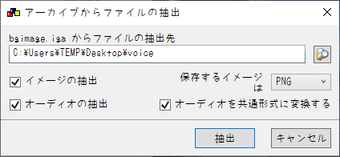
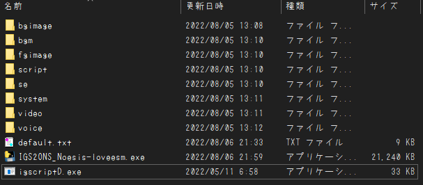

# IGS2ONS_Noesis-loveesm
## なにこれ
  2013年にNoesis様から発売された、18禁PC向けノベルゲーム'[ラブesエム](http://www.gungnir.co.jp/noesis/products/lovesm/index.html)'を 
  ONScripter形式へ変換するためのコンバータです 

## 再現度
原作との違いは主に以下
 - 画面特殊効果全般の実装が不完全(というか無)
 - 大多数の画像遷移は単純なフェードで代用
 - wait処理の待ち時間が原作と違う
 - セピア/モノクロ処理一切なし
 - セーブ/ロード画面は超簡略化
 - CG/音楽/回想モードは未実装 
   (GALLERYはとりあえずOPを流せるようになってます)

## 使い方
 1. 適当な作業フォルダを作成
 2. [GARBro](https://drive.google.com/file/d/1gH9nNRxaz8GexN0B1hWyUc3o692bkWXX/view)で全ての.igaを(同名のフォルダを作成した上で)作業フォルダへ展開 
     設定は以下の通り↓ 
     
 3. [IG_tools](https://github.com/lennylxx/IG_tools/releases/tag/v1.0.0)をDLし展開、**"igscriptD.exe"のみ**を作業フォルダへ移動 
 4. 展開先のディレクトリで[このコンバータ](https://github.com/Prince-of-sea/IGS2ONS_Noesis-loveesm/releases/latest)をDL/起動させ変換(最低でも数分程度はかかります) 
    変換前の時点で以下のような構成になっていればOKです↓ 
     
 5. ウィンドウが消え、0.txtができれば完成 
    exe等の不要データを削除し、変換済みファイルと共に利用ハードへ転送

## 注意事項
 - 当然ですが公式ツールではありません
 - __FANZA DL版で動作確認しています__ パッケージ版の動作は未確認
 - 本ツールの使用において生じた問題や不利益などについて、作者は一切の責任を負いません

## その他
 - 本作の変換を追加でサポートする[PSP向け自動変換ツール作ってます](https://github.com/Prince-of-sea/ONScripter_Multi_Converter) 
   もしPSPで遊ぶ場合はぜひご利用ください(v1.2.9以上推奨)
 - ゲームをプレイする際に利用する端末やONScripterのバージョンによっては、 
   OPムービーの音が途切れたり、スロー再生になったりする場合があります 
   適宜FFmpeg等で調整してください 
   (PSPの場合は上記ツールを利用すれば自動で変換してくれるため特に作業は不要です) 
